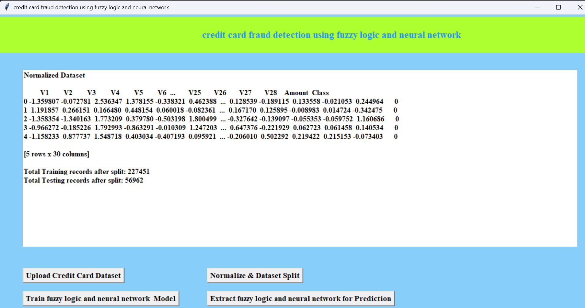
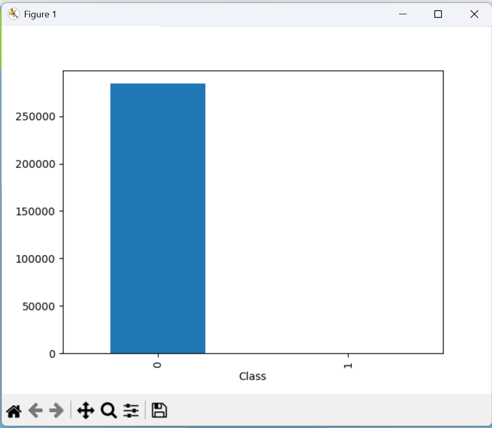
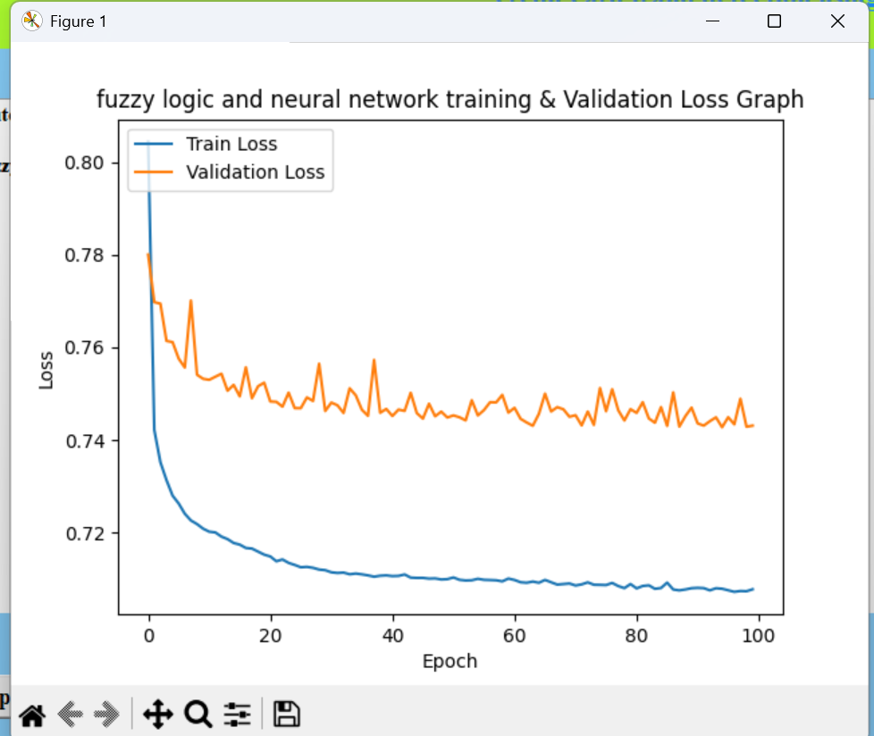

#  Credit Card Fraud Detection using Hidden Markov Model

 # Overview
 This project implements a multi-layered system designed to detect fraudulent credit card transactions by combining Fuzzy C-Means (FCM) Clustering and Neural Networks. The system aims to identify suspicious spending behaviors while significantly reducing the rate of false alarms.

#  How It Works
The detection process is executed in three distinct phases:

**Authentication:** Initial verification of card details and user identity.

**Behavioral Analysis:** Uses Fuzzy C-Means Clustering to find normal usage patterns based on past activity. A "suspicion score" is calculated based on how much a transaction deviates from these patterns.

**Learning Phase:** Suspicious transactions are passed to a Neural Network to determine if they are truly fraudulent or just an occasional deviation by a genuine user.

#  Tech StackLanguage: 

**Python Framework:** Django (for web integration) 

**Database:** MySQL 

**Design:** HTML, CSS, JavaScript 

**Environment:** MATLAB-2014 (used for core simulation and results) 

##  How to Run (Step-by-Step guide)
To get this project running on your own computer, follow these four simple steps:

**1. Prepare the Database**
* This project uses MySQL to store and manage transaction data.

* Open your MySQL tool (like XAMPP, WAMP, or MySQL Workbench).

* Create a new database named `fraud_detection`.

 If you have a `.sql` file in your project, import it into this new database.

**2. Install the Dependencies**
You need to install the Python libraries listed in your requirements.txt file so the code can "talk" to the database and run the math models. Open your terminal in the project folder and run:

`pip install -r requirements.txt`

**3. Start the Web Server**
This project uses Django to create the website interface. To start it up, type this in your terminal:

`python manage.py runserver`

**4. View the Project**
Open your web browser (Chrome, Edge, etc.) and go to this address:
`http://127.0.0.1:8000/`

##  Dataset
The dataset used for this project is too large for GitHub. You can download it here: 

https://drive.google.com/file/d/18N1rzgXZ-CweeKU89BdI19ObF5BcFW1e/view?usp=sharing

Once downloaded, place the file in the `/dataset` folder.

#  System Preview

**Phase 1:** Dataset Initialization
This phase shows the raw dataset being loaded and normalized. We split the data into 227,451 training records and 56,962 testing records. Normalization ensures that features with different scales (like 'Amount') do not dominate the model training.

 **Phase 2:** Understanding Class Imbalance
Before training the hybrid model, we analyze the distribution of genuine (Class 0) vs. fraudulent (Class 1) transactions. As seen below, the dataset is heavily imbalanced, requiring advanced techniques like FCM to create accurate profiles.

### Phase 3: Hybrid Model Training
Here, we train the Fuzzy C-Means logic and the Neural Network. This graph monitors the **Training vs. Validation Loss** over 100 epochs. A steady convergence (both lines flattening and staying close) indicates that the model is learning effectively without overfitting.

##  Results & Performance
The system was evaluated based on its ability to distinguish between genuine transactions and fraudulent ones.

### Accuracy and Metrics
* **Overall Accuracy:** 93.90%
* **FCM Clustering:** Successfully categorized users into spending profiles.
* **Neural Network:** Minimized false alarms by learning from suspicious deviations.

### Model Convergence Proof
This graph is critical. It shows that both the training loss (blue) and validation loss (orange) decreased steadily and flattened out, which is the definition of successful model convergence.

